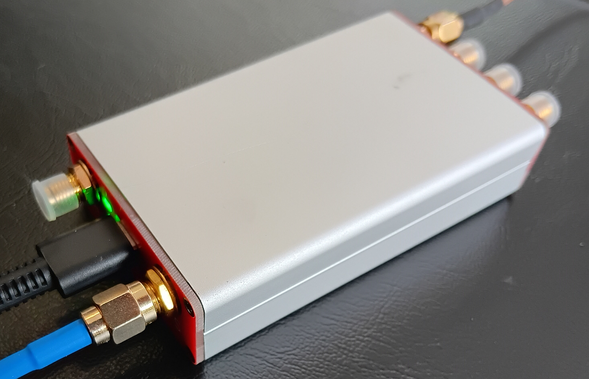
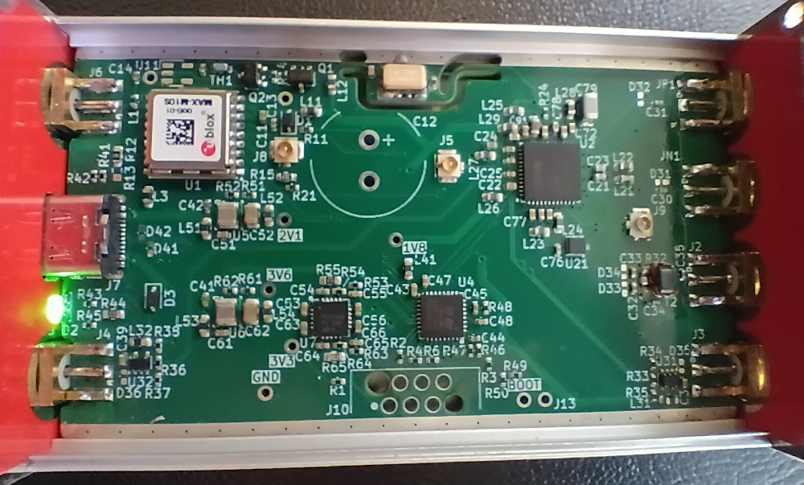

GPSfreak — GPS Disciplined Frequency Generator
=================================================

GPSfreak is a flexible, programmable, high-accuracy, low-jitter, frequency
generator, using GPS as a reference.

There are 5 outputs via 5 SMA connectors, with 4 separately programmable
frequencies derived from 2 PLLs.

The outputs are driven by a Texas Instruments LMK05318b clock generator, and a
U-Blox MAX-10 GPS receiver providing the overall frequency reference.

Power and data are supplied via a USB-C connector (USB FS data rate).  The GPS
unit is available over USB as a CDC ACM serial port.  In addition, there are USB
end-points for device control via the CPU, and Python scripts to drive this.

License
=======

The hardware designs in this project are all licensed under CERN Open Hardware
Licence, strongly reciprocal, CERN-OHL-S.  (`cern_ohl_s_v2.txt`).

All software in this project is licensed under the GNU GPL v3.  (`COPYING.txt`)

Connectors
==========

**Outputs 1+** and **1–**
: Complementary high frequency, 3 MHz to 1.6 GHz, 11 dBm nominal output power.
  These can be used together as a differential pair.  AC coupled.

**Output 2**
: High frequency.  3 MHz to 1.6 GHz, 11 dBm nominal output power.  AC coupled.
  There is provision for a balun on the PCB to raise the output power to 14 dBm.

**Output 3**
: Low frequency 3.3 V CMOS.  Sub-1 Hz to 325 MHz.  DC coupled.

**Output 4**
: Mid frequency 3.3 V CMOS.  3 MHz to 325 MHz.  DC coupled.

**GPS Input** for an active L1 and/or L5 GPS antenna.  It provides 3.3 V (or
5 V) antennae power.  The voltage selection is a strap resistor on board.

**USB-C**
: Power (approx 2 W) and data (USB FS).

The high frequency outputs provide complete coverage of 3 MHz to 800 MHz with ≈
pico-Hertz resolution, and then select frequencies to 1.6 GHz.  (There is a
region around 520 MHz where the LMK05318b is operated outside its documented
range, but I have seen no issue with this.)

The outputs are all nominally 50 Ω.  In fact, the LMK05318b appears to have
current-source outputs, so the drive impedance of the high-frequency outputs is
high.  The two CMOS level outputs are each driven by a TLV3601 comparator, from
the datasheet this appears to be a reasonable match for 50 Ω.

There are also pads for 3 internal U.Fl connectors.  One provides an additional
output, one a secondary reference clock input to the LMK05318b, and the last an
output of the GPS timepulse signal.  A possible use is to divert the GPS
timepulse to an external Rubidium clock, and then use that to drive the
secondary reference.

GPS
===

This is a U-Blox MAX-F10S.  (Building the board with other U-Blox MAX or
compatible devices is possible.  The firmware should work with any U-Blox MAX-10
or later device.)

Status LED
==========

There is a status LED next to the USB connector.  This is a three colour RGB
LED.  The LED lights green or red to indicate that the device has PLL lock.
Additionally, the blue component indicates USB activity.

Housing
=======

The board outline is just under 80 mm × 50 mm.  A matching extruded aluminium
housing (80 mm × 50 mm x 20 mm) can be readily obtained from websites such as
AliExpress.

There are small KiCad projects for end-plates (`end-in.kicad_pro` and
`end-out.kicad_pro`), with appropriately sized holes for the connectors and LED.
The screw holes can be counter-sunk with a drill as appropriate.

I recommend checking the board for fit before soldering the components on the
edges (USB and SMA connectors, and the LED).  If necessary, the edges of the
board can be sanded down slightly with sandpaper.

Heat-sinking
------------

The LMK05318b generates a bit of heat, and the board may reach temperatures
30 °C above ambient.  This should not be a problem, but provision is made to
heat-sink the rear of the PCB to the case.

There is an 11 mm × 7 mm exposed copper area backside to the LMK05318b.  Solder
a 2 mm thick copper slug to this, and then cover with a 1.5 mm thick thermal
pad.  The clearance between PCB and housing is 3 mm, so inserting the board into
the housing will apply gentle pressure to the thermal pad.  Chamfer the
appropriate edge of the housing with a file to make inserting the assembly
easier.

(You can find e.g., 2 mm × 10 mm × 100 mm copper bars on AliExpress, from which
an appropriate slug can be cut with a hacksaw.)

Software
========

The device software is a mix of on-board firmware, and Python scripts
(`py/freak.py`) to communicate with the device.  These should work on any OS
that pyusb supports.

The firmware is pretty dumb.  All the frequency planning logic is in the Python
scripts, with the firmware essentially just passing through commands to the GPS
and clock generator.  Frequency plans may be written to flash for autonomous
operation with no USB.

Firmware updates are done via USB DFU.  There is also a Skedd connector breaking
out the CPU SWD with a standard six pin connection.  The CPU boot pin is taken
to a 0.1" header, which can be used to access DFU in case of corrupted firmware.

The Python scripts should work with Python 3.10 or later.

Board Manufacture
=================

The schematic has JLCPCB part numbers for most components.  Components that I've
hand assembled are marked with `exclude from BOM´ and may or may not have the
part number.  Review and change these to suit.

The Makefile should generate Gerber and component files, just run `make`.

The I/O traces (GPS, clock outputs, and USB) are sized for appropriate impedance
on the JLCPCB 4-layer default stack-up (7628).  None of them should be
especially critical, but if you use a different stack-up, then it is worth
double-checking and adjusting them.

Components that I have hand-soldered in preference to using JLCPCB assembly:

* JLCPCB doesn't stock the MAX-F10S.  It is fairly easy to hand-solder.  They do
  stock the cheaper MAX-M10S.
* The USB-C connector, saving a handling fee.
* The SMA connectors.  Position them carefully as they need to align with the
  end-plate holes!  These are edge-launch connectors for a 1.6 mm PCB.  You
  can get these cheaply in bulk from AliExpress.  The ones I used have approx
  12 mm thread length, 18_mm total length including leads.
* The 0402 antennae bias inductor.  The pads are designed for easy hand
  soldering (one is bigger than the other, solder the smaller pad first).
* Likewise, the antennae power PTC fuse and the 74HC1G07 for antennae-short
  detection are hand-soldered, to save assembly costs.  The 74HC1G07 is
  optional.
* The three C0G/NP0 loop-filter caps (C78, C79, C92).
  JLCPCB doesn't have the exact parts.
* The LED.
* The TVS protection diodes I have never populated.  The 0402 pads are designed
  for hand-soldering just like the inductor above.

If you want to keep assembly costs down, then hand soldering many of the ICs is
an option.  This is especially true if you only want one board, as most
manufacturers insist on making multiple!

There is enough space between most of the ICs and surrounding passive components
to get a soldering iron in, but if you are unsure of your soldering equipment
and skills, then review the board layout before committing yourself to that.

Initial Software Install and Configuration
==========================================

This is a rather manual process at the moment.

Firmware build & install
------------------------

For the firmware build, install a recent \`nightly´ rust compiler, along with
cargo, along with the `thumbv8m.main-none-eabihf` target to support the CPU.

Build the firmware with `cargo b`.  This is an alias to build with the correct
compiler options.  The .elf file is left in
`target/thumbv8m.main-none-eabihf/release/freak.elf`.

The initial firmware install can either be done via a SWD dongle (J-Link or
similar) or via DFU USB.  Most SWD programmers support `.elf` files directly.
`dfu-utils` is an unfriendly command line tool, the `dfu.sh` script works for
me.  Note that the shell script assumes you have only one DFU capable device
attached.

The `freak` tool is written in Python.  You need Python 3.10 or later.  The only
additional Python module you need should be `pyusb`, which can be installed
using `pip`.

Initial configuration
---------------------

Run `freak config manufacture`.  This will upload a fairly sane default
configuration for the device, with all outputs at 10 MHz, except for 1 Hz on
output 3.  The DPLL bandwidth is set to 0.3 Hz, which is quite low, and requires
a decent TCXO to achieve lock

If you want to customize the configuration:
 * The uploaded default LMK05318b configuration expects a 8844582 Hz reference
   from the GPS unit.  If you choose something different, be careful about
   near-integer aliasing from the GPS.
 * Loss-of-lock LED indication relies on the GPS turning off that reference
   when GPS signal is lost.  Don't configure the GPS to output the reference
   with no GPS signal (CFG-TP-FREQ_TP1).
 * You can use TICS/Pro to customize the LMK05318b configuration.  Start
   from `py/freak/bw0p3hz_ref8844582.tcs` or another in py/freak/*.tcs.
 * Note that TICS/Pro tends to silently change the lock parameters to values
   that are not good for this hardware.  After running the DPLL script, go to
   the 'Reference Validation' and 'DPLL and BAW flags' tabs, and ensure that
   the Early Window Detector and Lock Thres values are both at least 17 ns.
 * Setting the host-side UART baud rate **must** be done using `freak gps baud`,
   the normal OS serial port baud rate setting is ignored.  I use
   230400 baud; the default 9600 is awfully slow.
 * The initial configuration mentioned above sets `TP-ALIGN_TO_TOW_TP1` to
   False.  This improves short term frequency accuracy, at the expense of a
   small (≈ 3 ppt) long term inaccuracy.

Internal Control Lines
======================

The CPU has various control lines to the GPS and clock chip.  There is UART to
the GPS, and all are on an I2C bus.  In addition, there are connections to:

* EXTINT and RESET lines on GPS.
* PDN, STATUS0, STATUS1 / FDEC and GPIO2 / FINC on the clock chip.  The latter
  two potentially allow some degree of frequency modulation to be achieved e.g.,
  a basic low bit-rate FSK.

Hardware Options
================

The three U.Fl connectors can be soldered.  The GPS timepulse output also
requires soldering a 50 Ω 0603 or similar termination component.

There are pads for a balun on output 2.  If wanted, remove the two 0603
resistors, and solder a 2:1 impedance balun, for a 3 dB increase in output
power.

Before building a device:
 * There are a lot of closely spaced 0402 components on the board.  Unless you
   want the soldering practice, get the majority of the components soldered by
   the board manufacturer.  Most components have JLCPCB part numbers.
 * Review the BOM lists and PCB layout, and check that you are comfortable
   with any components you are going to hand solder.

Component Substitutions
-----------------------

Some notes on possible component substitutions / changes.

**GPS** Any U-Blox MAX-10 is a drop-in replacement.  The software should be
compatible with any U-Blox unit with the newer configuration messages (F9 and
later).  Hardware-wise, any U-Blox 18-pin module should be electrically
compatible.

**LMK05318b** Do not use the non-`b´ LMK05318:
  * With the 3.3 V swing on the reference input, you need to DC couple it, which
    is only supported on the `b´ variant.
  * The software uses the programmable PLL2 denominator.

**C0G/NP0 caps** These are probably overkill for the loop-filter caps.  Feel
free to replace with (smaller and cheaper) X5R / X7R.  In that case I suggest
use parts with a voltage rating of at least 10 V, to minimize the X5R / X7R
voltage dependence.  C78 is only in the schematic because the physically larger
C79 is some distance from the LMK05318b.  If you use smaller components, then
change C78 to 470 nF and remove C79.

If you don't want to hand-solder C78, you could reduce the value to 330 pF
(which JLCPCB has as a basic component).

**Ferrite Beads** I used 100 Ω @ 100 MHz, because JLCPCB had them as basic parts
(no loading fee).  The TI evaluation board has 220 Ω @ 100 MHz.  The choice is
probably not critical, but if you use parts with DC resistance above 0.1 Ω then
double check power consumption and voltage drop on the various voltage rails.

I'm not sure how much difference the ferrite beads make in practice.  If you
remove them entirely, then all the point-of-load 10 µF caps on the power rails
can be replaced by 0.1µF caps.  (Don't change C77, C91 and C93 though.)

**Filter caps** I've used 0402 10 µF caps, where-as the LMK05318b datasheet
suggests 10 µF 0402 plus 0.1 µF 0201.  The main reason is that they are cheaper
with JLCPCB (0201 caps incur loading and assembly fees).

**CPU** Basically any QFN-32 STM32 with USB should be a drop-in replacement
hardware-wise, and require few software modifications—likely only the CPU
initialization and USB clocking will need to change.  Likewise, a CPU in a
different package should require only minor board modifications.

**Voltage regulators** I provisioned 1.8 V as well as 3.3 V in order to reduce
power dissipation.  TI suggests using LDOs to reduce noise.  Having the two
switching regulators before the LDOs reduces power consumption and heating,
without them the LDO would probably overheat.  Beyond that, the power supply
circuitry is fairly arbitrary.

If you switch to a CPU with that supports 1.8 V I/O then you could run the GPS
at 1.8 V also (but in that case, you'll need to supply 3.3 V to the GPS antennae
bias.)

The feedback divider resistors are chosen to avoid JLCPCB loading fees.
Additionally, fine-grained margining of the LDO output voltages can be achieved
by replacing the two 0603 resistors, R56 and R66.

**SMA Connectors** Feel free to replace with through-hole rather than
edge-mount.  In that case, also straighten the board edge, as you no longer need
the cut-outs.  You will need to adjust the position of the mounting-holes in the
end-plates appropriately.

**Programming Header** This can be removed, or swapped for whatever you fancy.
You need to keep one of either the SWD header, or else the boot-pin header, in
order to load firmware.  (Once you have functioning firmware installed, you can
upgrade purely via software command.)

**Temperature Sensor** Populating this is optional.

**LED** This is a common 1206 edge-mount footprint RGB LED.  If you use a
different part, then double or triple check the footprint, and note the odd pad
numbering.

**PTC Fuse** U-Blox example schematics just use a current limiting resistor.
Which would be cheaper. The 74HC1G07 logic gate for antennae short-circuit
sensing is optional.

Hardware Versioning
===================

[TODO - change pin.] CPU pin 13 A7 is reserved for hardware versioning.  The
plan is to use the CPU ADC to read a resistor voltage divider.  To change the
hardware revision, drive with a resistor divider, approx. 10k Thevenin
resistance or less, to N / 25 × VDD, where N is the revision number.  This is
revision 0, so the pin is grounded.

Cost Reduction Opportunities
============================

The MAX-M10S is a cheaper alternative to MAX-F10S, but still performs OK, albeit
with a slightly worse short-term frequency accuracy.

The TCXO can be replaced by a cheaper one.  The phase noise to worry about is
capped above at around 18 kHz by the BAW oscillator, and at low frequencies by
the GPS output.  Using a TCXO rather than an XO is probably not essential, but
does allow us to run the LMK05318b at low bandwidth and smooth out the
once-per-second frequency adjustments from the GPS unit.

The CPU is overkill.  With the current arrangement of dumb firmware & all the
smarts in the Python scripts, a low-end CPU would be just fine.

The temperature sensor is only for development.  Once we know how much heat the
board generates, we can drop it.  Or just use a 1 ¢ thermistor.  There is also
the CPU temperature sensor.

Evaluate whether or not the C0G capacitors on the loop filter are worthwhile.  I
suspect not in realistic conditions.  The 0.47 µF C0G cap could also be replaced
by a through-hole film cap.

The super cap is more or less redundant.  It's only to speed up GPS start-up
after a short power outage, but we are likely to be always on anyway.

The output balun on output 2 is not worth the cost.  I've marked it as DNP
in the schematic.

The `freak` tool
================

The `freak` tool can perform various operations as well as setting the output
frequencies.  Everything has a `--help` option which is hopefully helpful.

`freak freq` with no arguments displays the current output frequencies.  Give it
arguments to set the output frequencies.  The units default to MHz, but an
explicit unit of Hz, kHz or GHz may be given.  Rational numbers (e.g., 100/3)
are accepted, and avoid rounding errors inherent with decimals (33.333333).

`freak plan` can carry out the frequency planning computations without writing
them to the device.  This is useful to explore what is possible.

`freak drive` can display and set the various output drive strengths.

`freak clock get/set` and get and set individual clock generator registers.  The
TI documentation lists most but not all of these.  The file
`py/freak/lmk05318b.list` has a few additions that I've gleaned from other
sources.

`freak gps get/set` likewise get and set GPS config registers.

For more advanced programming of the LMK05318b, your best option is to generate
a `.tcs` file with the TI TICS/Pro tool, and write to the device with `freak
clock upload`.

`freak info`, `freak clock status`, `freak gps info` and `freak gps status` all
output various bits of hardware information and status, in varying degrees of
understandability.

`freak gps changes` shows the difference between the current GPS configuration
and the factory defaults.

`freak clock dump` or `freak gps dump` print the entire clock generator or GPS
configuration, respectively.

Known Issues
============

If frequency planning fails, then `freak` tends to die with an unfriendly
assertion failure rather than a useful error message.  Ditto various other error
conditions.  Problems with the communication to the GPS unit likely result in
hangs.

Change Log
==========

Current
-------

Enlarge the exposed pad backside to the clock chip to be 11 mm × 7 mm instead of
7 mm square.

Don't have the LED overhanging the board edge.  Change all the LED resistors to
0603 for easier swapping.  Plate the panel cut-out opening for the LED.

Remove the unnecessary strap resistor on the GPS timepulse U.Fl connector.

Hardware version 1.0
--------------------

Two built.  Major revision from prototype.  git rev 496bb8c98727dc07.

Prototype
---------

Hardware was git rev 24c0655742e6f093.  Only one built.
